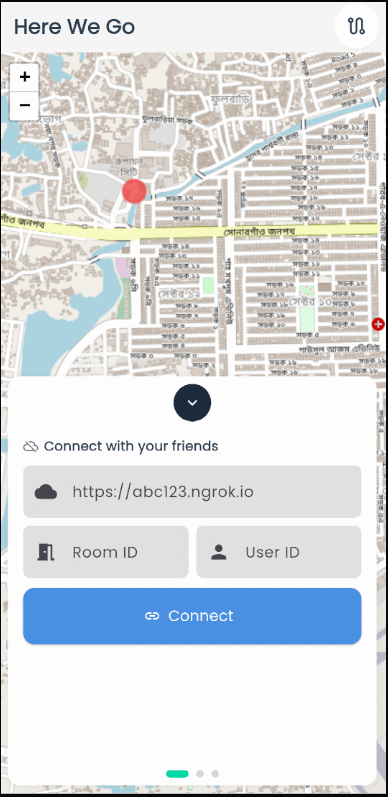

# Here We Go

Here We Go is a comprehensive real-time location tracking and navigation application built with Flutter, Node.js, and Socket.IO. It enables users to share their live GPS locations, communicate through group chat, and navigate to each other with turn by turn directions, all within a collaborative environment.

## Features

- **Real-Time Location Sharing & WebSocket Communication:** Implements bidirectional Socket.IO WebSocket connections for real-time location broadcasting. The `ConnectionService` manages socket lifecycle with automatic reconnection (5 attempts, 1s delay), while `LocationService` handles location updates with timestamps. Backend maintains in-memory Maps for room state, user locations, and session management with automatic cleanup on disconnection.

- **Interactive Mapping with Custom WebView Integration:** Custom `Leaflet.js` implementation embedded in Flutter WebView with JavaScript channel communication for native-to-web control. Supports programmatic map manipulation (zoom, pan, bounds fitting), dynamic marker rendering with custom SVG pins, and real-time polyline updates. Achieves native performance through message passing between Flutter and embedded web context.

- **Navigation with Automatic Rerouting:** Implements continuous GPS tracking (5m distance filter, high accuracy mode) with state machine transitions (idle, navigating, rerouting, arrived). Monitors route deviation with 50m threshold and triggers OSRM API recalculation with 15s debounce. Calculates live metrics (distance, ETA, speed) from Position streams and handles dynamic destination updates when target user moves.

- **OSRM-Based Route Calculation with Caching:** Integrates Open Source Routing Machine API for multi-modal routing (driving/walking/cycling). Implements composite key caching (origin-destination-mode) to minimize API calls. Parses GeoJSON geometry responses and converts to LatLng polyline coordinates. Includes 10s timeout with direct-line fallback on API failure.

- **Group Chat with Server-Side Persistence:** Message storage with unique IDs (timestamp with random string) maintained per room on backend. `ChatService` manages ordered message lists with stream based updates. Integrates Flutter Local Notifications with platform-specific channels (Android/iOS) and app lifecycle monitoring for background message alerts.

- **Provider-Based State Management:** Seperate providers (Connection, Location, Chat, Navigation, Route, UserLocation) with singleton service pattern. Uses `StreamController.broadcast()` for reactive UI binding across multiple listeners. Maintains clean separation between business logic and presentation with unidirectional data flow.

- **Backend Session & Memory Management:** Node.js/Express server with Socket.IO handling room-based architecture. Nested Map structures for rooms, users and location data. Event driven architecture `('join-room', 'share-location', 'send-message', 'user-left')` with automatic room deletion on empty state. Exposes REST endpoints for room inspection and server health checks.

## Technical Stack

**Frontend:** Flutter, Provider, Geolocator, WebView, Flutter Local Notifications
**Backend:** Node.js, Express, Socket.IO, CORS
**Mapping:** OpenStreetMap tiles, Leaflet.js, OSRM API
**Communication:** WebSocket (Socket.IO), JavaScript Channel (WebView Bridge)
**State:** Singleton services, Stream based reactivity, In memory caching

## Preview



## Setup Guide

- Start the `herewego-server` by running `npm run dev`.
- Use ngrok to expose the local server to the internet by running `ngrok http 3000` (the backend runs on port 3000).
- Launch the application, connect it to the server, and enable location sharing with other users.
- Set up the following Node.js server to support real-time location sharing, route visualization, and messaging functionality.

``` javascript
// Configuration
const io = require('socket.io-client');

// Configuration
const SERVER_URL = '';
const ROOM_ID = '';

// Simulated users within 10km of Dhaka (23.7104, 90.4074)
// Approximately 0.09 degrees ≈ 10km
const users = [
  { userId: 'Rifat', lat: 23.7804, lng: 90.4174 },   // Gulshan area (North)
  { userId: 'Tushar', lat: 23.7304, lng: 90.3974 },     // Dhanmondi area (West)
  { userId: 'Rana', lat: 23.7504, lng: 90.3774 }, // Mohammadpur area (Southwest)
  { userId: 'Tony', lat: 23.7404, lng: 90.4374 },   // Motijheel area (East)
  { userId: 'Mehedi', lat: 23.6904, lng: 90.4074 }      // Jatrabari area (South)
];

// Chat message templates
const messageTemplates = [
  "Hey everyone!",
  "Where are you guys?",
  "I'm on my way!",
  "Traffic is crazy here",
  "Should be there in 10 minutes",
  "Anyone want to grab food?",
  "Let's meet at the usual spot",
  "Running a bit late, sorry!",
  "I can see you on the map",
  "Almost there!",
  "Wait for me guys",
  "This location looks good",
  "I'm nearby now",
  "Can you share your location?",
  "Heading out now",
  "See you soon!",
  "Perfect weather today",
  "How far are you?",
  "Let me know when you arrive",
  "I'm at the corner",
  "Just parked my car",
  "Looking for parking",
  "Which way should I go?",
  "Got stuck in traffic jam",
  "Finally moving again!"
];

// Store socket connections
const connections = [];
let chatInterval = null;

// Connect a single user
function connectUser(user) {
  return new Promise((resolve, reject) => {
    console.log(`\nConnecting ${user.userId}...`);
    
    const socket = io(SERVER_URL, {
      transports: ['websocket'],
      reconnection: true
    });

    socket.on('connect', () => {
      console.log(`${user.userId} connected (Socket ID: ${socket.id})`);
      
      // Join room
      socket.emit('join-room', {
        roomId: ROOM_ID,
        userId: user.userId
      });
    });

    socket.on('joined-room', (data) => {
      console.log(`${user.userId} joined room: ${data.roomId}`);
      console.log(`   Users in room: ${data.usersInRoom.join(', ')}`);
      
      resolve({
        socket,
        userId: user.userId,
        currentLat: user.lat,
        currentLng: user.lng
      });
    });

    socket.on('user-joined', (data) => {
      console.log(`${user.userId} sees: ${data.userId} joined the room`);
    });

    socket.on('user-left', (data) => {
      console.log(`${user.userId} sees: ${data.userId} left the room`);
    });

    socket.on('location-update', (data) => {
      console.log(`${user.userId} received location from ${data.userId}: (${data.latitude.toFixed(4)}, ${data.longitude.toFixed(4)})`);
    });

    socket.on('existing-locations', (data) => {
      const userCount = Object.keys(data).length;
      console.log(`${user.userId} received ${userCount} existing location(s)`);
    });

    socket.on('location-shared', (data) => {
      // Optional: uncomment to see share confirmations
      // console.log(`✓ ${user.userId}'s location shared successfully`);
    });

    socket.on('new-message', (data) => {
      console.log(`${user.userId} sees message from ${data.userId}: "${data.message}"`);
    });

    socket.on('chat-history', (data) => {
      const msgCount = data.messages.length;
      if (msgCount > 0) {
        console.log(`${user.userId} received ${msgCount} chat message(s) from history`);
      }
    });

    socket.on('error', (data) => {
      console.error(`${user.userId} error: ${data.message}`);
    });

    socket.on('disconnect', (reason) => {
      console.log(`${user.userId} disconnected: ${reason}`);
    });

    socket.on('connect_error', (error) => {
      console.error(`${user.userId} connection error:`, error.message);
      reject(error);
    });

    // Store user data with socket
    socket.userData = user;
  });
}

// Share location for a user
function shareLocation(connection) {
  const { socket, userId, currentLat, currentLng } = connection;
  
  socket.emit('share-location', {
    roomId: ROOM_ID,
    userId: userId,
    latitude: currentLat,
    longitude: currentLng
  });
  
  console.log(`${userId} shared location: (${currentLat.toFixed(4)}, ${currentLng.toFixed(4)})`);
}

// Send a chat message
function sendMessage(connection, message) {
  const { socket, userId } = connection;
  
  socket.emit('send-message', {
    roomId: ROOM_ID,
    userId: userId,
    message: message
  });
  
  console.log(`${userId} sent: "${message}"`);
}

// Get a random message template
function getRandomMessage() {
  return messageTemplates[Math.floor(Math.random() * messageTemplates.length)];
}

// Simulate chat activity
function simulateChatActivity() {
  const activeConnections = connections.filter(c => c.socket.connected);
  
  if (activeConnections.length === 0) return;
  
  // Random chance (30%) that someone sends a message
  if (Math.random() < 0.3) {
    const randomUser = activeConnections[Math.floor(Math.random() * activeConnections.length)];
    const message = getRandomMessage();
    sendMessage(randomUser, message);
  }
}

// Simulate movement (random walk)
function simulateMovement(connection) {
  // Small random movement (roughly 0.001 degrees ≈ 100 meters)
  const deltaLat = (Math.random() - 0.5) * 0.002;
  const deltaLng = (Math.random() - 0.5) * 0.002;
  
  connection.currentLat += deltaLat;
  connection.currentLng += deltaLng;
  
  shareLocation(connection);
}

// Main simulation function
async function runSimulation() {
  console.log('Starting Location Sharing & Chat Simulation');
  console.log(`Server: ${SERVER_URL}`);
  console.log(`Room: ${ROOM_ID}`);
  console.log(`Users: ${users.length}`);
  console.log('='.repeat(60));

  try {
    // Connect all users
    console.log('\n PHASE 1: Connecting Users');
    console.log('-'.repeat(60));
    
    for (const user of users) {
      const connection = await connectUser(user);
      connections.push(connection);
      
      // Wait a bit between connections to see the flow
      await new Promise(resolve => setTimeout(resolve, 1000));
    }

    // Wait for all connections to stabilize
    await new Promise(resolve => setTimeout(resolve, 2000));

    // Share initial locations
    console.log('\n PHASE 2: Sharing Initial Locations');
    console.log('-'.repeat(60));
    
    for (const connection of connections) {
      shareLocation(connection);
      await new Promise(resolve => setTimeout(resolve, 500));
    }

    // Send initial greeting messages
    console.log('\n PHASE 3: Initial Greetings');
    console.log('-'.repeat(60));
    
    await new Promise(resolve => setTimeout(resolve, 1000));
    sendMessage(connections[0], "Hey everyone!");
    await new Promise(resolve => setTimeout(resolve, 800));
    sendMessage(connections[1], "Hi! I'm at Dhanmondi");
    await new Promise(resolve => setTimeout(resolve, 1200));
    sendMessage(connections[2], "On my way!");
    await new Promise(resolve => setTimeout(resolve, 1000));
    sendMessage(connections[3], "See you guys soon!");
    await new Promise(resolve => setTimeout(resolve, 900));
    sendMessage(connections[4], "Traffic is crazy today");

    // Simulate movement and chat (3 minutes)
    console.log('\n PHASE 4: Simulating Movement & Chat (3 minutes)');
    console.log('          Note: Tushar stays stationary but still chats');
    console.log('-'.repeat(60));
    
    // Movement updates every 3 seconds
    const movementInterval = setInterval(() => {
      // Randomly select 1-2 users to move (excluding Tushar)
      const movableUsers = connections.filter(c => c.userId !== 'Tushar');
      const numMoving = Math.floor(Math.random() * 2) + 1;
      const shuffled = [...movableUsers].sort(() => Math.random() - 0.5);
      
      for (let i = 0; i < Math.min(numMoving, shuffled.length); i++) {
        simulateMovement(shuffled[i]);
      }
    }, 3000);

    // Chat activity every 5-15 seconds
    chatInterval = setInterval(() => {
      simulateChatActivity();
    }, Math.random() * 10000 + 5000); // Random interval between 5-15 seconds

    // Run for 3 minutes (180 seconds)
    await new Promise(resolve => setTimeout(resolve, 180000));
    clearInterval(movementInterval);
    clearInterval(chatInterval);

    // Goodbye messages before leaving
    console.log('\n PHASE 5: Saying Goodbye');
    console.log('-'.repeat(60));
    
    const leavingUsers = connections.filter(c => c.userId !== 'Tushar');
    for (let i = 0; i < leavingUsers.length; i++) {
      const connection = leavingUsers[i];
      const goodbyeMessages = [
        "Gotta go, see you later!",
        "Bye everyone!",
        "Leaving now, catch you later!",
        "Thanks guys, heading out!",
        "Take care everyone!"
      ];
      sendMessage(connection, goodbyeMessages[i % goodbyeMessages.length]);
      await new Promise(resolve => setTimeout(resolve, 800));
    }

    await new Promise(resolve => setTimeout(resolve, 2000));

    // Tushar sends a message
    const tusharConnection = connections.find(c => c.userId === 'Tushar');
    if (tusharConnection) {
      sendMessage(tusharConnection, "I'll stay here for a while. Bye everyone!");
    }

    await new Promise(resolve => setTimeout(resolve, 1000));

    // Disconnect all users EXCEPT Tushar
    console.log('\n PHASE 6: Everyone Leaves Except Tushar');
    console.log('-'.repeat(60));
    
    const usersToDisconnect = connections.filter(c => c.userId !== 'Tushar');
    for (const connection of usersToDisconnect) {
      console.log(`Disconnecting ${connection.userId}...`);
      connection.socket.disconnect();
      await new Promise(resolve => setTimeout(resolve, 1000));
    }

    // Tushar continues alone for 30 minutes
    console.log('\n Tushar remains alone in the room for 30 minutes...');
    console.log('   (He might send an occasional message to himself)');
    console.log('-'.repeat(60));
    
    // Tushar sends occasional lonely messages
    const lonelyMessages = [
      "Still here...",
      "Anyone coming back?",
      "Pretty quiet now",
      "Guess I'll wait a bit more",
      "Hope everyone got home safe!"
    ];

    for (let i = 0; i < lonelyMessages.length; i++) {
      await new Promise(resolve => setTimeout(resolve, 6 * 60 * 1000)); // Every 6 minutes
      if (tusharConnection && tusharConnection.socket.connected) {
        sendMessage(tusharConnection, lonelyMessages[i]);
      }
    }

    // Clean up - disconnect Tushar
    console.log('\n PHASE 7: Cleaning Up (Disconnecting Tushar)');
    console.log('-'.repeat(60));
    
    if (tusharConnection && tusharConnection.socket.connected) {
      sendMessage(tusharConnection, "Alright, I'm leaving too. Goodbye!");
      await new Promise(resolve => setTimeout(resolve, 1000));
      console.log(`Disconnecting ${tusharConnection.userId}...`);
      tusharConnection.socket.disconnect();
    }

    console.log('\n Simulation Complete!');
    console.log('='.repeat(60));
    
    process.exit(0);
  } catch (error) {
    console.error(' Simulation error:', error);
    if (chatInterval) clearInterval(chatInterval);
    process.exit(1);
  }
}

// Handle graceful shutdown
process.on('SIGINT', () => {
  console.log('\n\n Received SIGINT, cleaning up...');
  if (chatInterval) clearInterval(chatInterval);
  for (const connection of connections) {
    if (connection.socket.connected) {
      connection.socket.disconnect();
    }
  }
  process.exit(0);
});

// Run the simulation
runSimulation();
```

**Note:** Ensure the `SERVER_URL` matches the URL provided by `ngrok http 3000` command, and use the same `ROOM_ID` in both the server and the app to establish a successful connection.